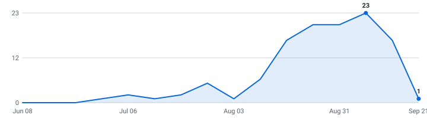

# Indian Tech Roles (2026 Graduates)

   

A self-updating engine that tracks tech roles and internships for 2026 graduates so you don't have to. Instead of refreshing a dozen career pages by hand, it reads company hiring feeds directly and keeps one live list, newest roles on top, refreshed automatically throughout the day.

**17 open roles · 17 new this week · 4,908 companies tracked · updated Aug 23, 2026 at 07:33 UTC**

**⭐Star this repo⭐** to save it and get updates when new roles are added.

**Live:** [dashboard](https://smeerdev.github.io/Job-finder-agent/) · [RSS feed](https://smeerdev.github.io/Job-finder-agent/feed.xml) (instant alerts in any RSS app) · [JSON API](https://smeerdev.github.io/Job-finder-agent/api/jobs.json)

**🔔 New roles in your inbox:** [subscribe by email](https://smeerdev.github.io/Job-finder-agent/#subscribe) - one email a day, only when new internships actually appeared, one-click unsubscribe. (Prefer RSS-to-email? [Feedrabbit works too](https://feedrabbit.com/subscriptions/new?url=https%3A%2F%2Fraw.githubusercontent.com%2FSmeerdev%2FJob-finder-agent%2Fmain%2Fdocs%2Ffeed.xml).)
---

## 2026 Graduates (International)  (17 open)

| Company | Role | Category | Pay & Specs | Location | Posted | Apply |
|---|---|---|---|---|---|---|
| Cisco | Software Engineer – Network/Embedded/Application Development (Summer Internship) - India EG Requisition ~ 🆕 | Software | B.Tech/BS | Bangalore, India | Aug 21, 2026 | [Apply](https://cisco.wd5.myworkdayjobs.com/cisco_careers/job/Bangalore-India/Software-Engineer---Network-Embedded-Application-Development--Summer-Internship----India-EG-Requisition_2021284-1) |
| MillerKnoll | Associate Web Analytics Engineer ~ | Data & ML/AI | B.Tech/BS | India - Bengaluru | Aug 21, 2026 | [Apply](https://millerknoll.wd1.myworkdayjobs.com/MillerKnoll/job/India---Bengaluru/Associate-Web-Analytics-Engineer_JR109610-2) |
| DTCC | Software Development Test Engineering Associate ~ | Software | B.Tech/BS | Hyderabad, India | Aug 20, 2026 | [Apply](https://ebxr.fa.us2.oraclecloud.com/hcmUI/CandidateExperience/en/sites/CX_1/job/214443) |
| Tower Research Capital | Intern - AI/ML ~ | Data & ML/AI | PhD | gurgaon | Aug 20, 2026 | [Apply](https://www.tower-research.com/open-positions/?gh_jid=8143756) |
| Cigna Group | Software Engineering Associate Advisor - HIH - Evernorth ~ | Software | B.Tech/BS | Hyderabad, India | Aug 19, 2026 | [Apply](https://cigna.wd5.myworkdayjobs.com/cignacareers/job/Hyderabad-India/Software-Engineering-Lead-Analyst---HIH---Evernorth_26007767) |
| Cigna Group | Machine Learning Associate Advisor - HIH - Evernorth ~ | Data & ML/AI | B.Tech/BS | Hyderabad, India | Aug 18, 2026 | [Apply](https://cigna.wd5.myworkdayjobs.com/cignacareers/job/Hyderabad-India/Machine-Learning-Associate-Advisor--HIH-Evernorth_26006299) |
| BlackRock | Associate - Power Bi Developer, Data Analytics ~ | Data & ML/AI | B.Tech/BS | Mumbai, India | Aug 13, 2026 | [Apply](https://blackrock.wd1.myworkdayjobs.com/BlackRock_Professional/job/Mumbai-India/Analyst--Data-Analytics_R263882) |
| Quora | Software Engineer, Machine Learning Platform, New Grad - Quora (Remote) | Data & ML/AI | 0-1 Yr B.Tech/BS | Remote - Multiple Locations | Jul 31, 2026 | [Apply](https://jobs.ashbyhq.com/quora/452afc2e-0c79-41f8-8201-1aab7df775db) |
| Epicor | Interns - Content Developer /Technical Writing/ Instructional Designer ~ | Software | 0-1 Yr B.Tech/BS | India, Bangalore | Jul 30, 2026 | [Apply](https://epicorsoftware.wd5.myworkdayjobs.com/epicorjobs/job/India-Bangalore/Interns---Content-Developer--Technical-Writing--Instructional-Designer_JR105255) |
| AffirmedRx | Associate, Data Engineer ~ | Data & ML/AI | B.Tech/BS | Remote | Jul 28, 2026 | [Apply](https://job-boards.greenhouse.io/affirmedrxpbc/jobs/5372829008) |
| ReliaQuest | Associate Software Engineer ~ | Software | 0-1 Yr | Pune India Office | Jul 15, 2026 | [Apply](https://reliaquest.wd5.myworkdayjobs.com/ReliaQuest_Careers/job/Pune-India-Office/Associate-Software-Engineer_R15032) |
| Priceline | Associate Software Engineer ~ | Software | 2+ Yrs B.Tech/BS | Mumbai | Jul 10, 2026 | [Apply](https://priceline.wd1.myworkdayjobs.com/Priceline/job/Mumbai/Associate-Data-Engineer_R5635) |
| Oaktree Capital Management | Associate - Workday reporting developer ~ | Software | B.Tech/BS | Hyderabad | Jun 30, 2026 | [Apply](https://oaktree.wd1.myworkdayjobs.com/oaktree/job/Hyderabad/Associate---Workday-reporting-developer_2026-337) |
| Genworth Financial | Associate Application Development Analyst (.Net Developer) ~ | Software | B.Tech/BS | Remote India | Oct 21, 2025 | [Apply](https://gnw.wd1.myworkdayjobs.com/GNW/job/Remote-India/Associate-Application-Development-Analyst--Net-Developer-_REQ-250458) |
| Amgen | Associate PLM Software Engineer ~ | Software | B.Tech/BS | India - Hyderabad | Sep 30, 2025 | [Apply](https://amgen.wd1.myworkdayjobs.com/careers/job/India---Hyderabad/Associate-Software-Engineer_R-226973) |
| Valeo | Intern - AI ~ | Data & ML/AI | — | Chennai | Aug 06, 2025 | [Apply](https://valeo.wd3.myworkdayjobs.com/valeo_jobs/job/Chennai/Intern---AI_REQ2025061319) |
| Oneture Technologies | AI / ML Intern ~ 🆕 | Data & ML/AI | — | Mumbai | — | [Apply](https://www.instahyre.com/job-390123-ai-ml-intern-at-oneture-technologies-mumbai/) |

_~ = the title doesn't state a year; bucketed here from its posting date (16 of 17)._

## What this is

This is an engine, not a hand-kept list. It polls company career feeds several times a day, finds the internships, removes duplicates, and rebuilds this page on its own. Every link comes straight from the source, so it's real and current, not a stale list someone forgot to update (speed matters).

## What makes this different

- **📅 [Drop Radar](#drop-radar)** - the only list that shows **what's coming**: each marquee company's typical opening window, then confirmed with the real drop date the moment the engine catches it live.
- **Real posted dates on every role** - pulled from each job portal itself, so newest-first actually means newest.
- **Skill tags + pay, extracted** - every posting's text is scanned for the stack it wants (Python, C++, PyTorch, ...) and the pay it states - searchable on the [dashboard](https://smeerdev.github.io/Job-finder-agent/), included in the CSV and API.
- **Alerts your way** - [email digests](https://smeerdev.github.io/Job-finder-agent/#subscribe), [RSS](https://smeerdev.github.io/Job-finder-agent/feed.xml), or Discord - plus a [live dashboard](https://smeerdev.github.io/Job-finder-agent/) with search and custom filters.
- **An engine, not a spreadsheet** - polled every hour across multiple ATS platforms with full source in this repo.

## Scope

- **Roles:** Software Engineering, Data Science & Machine Learning (and closely related technical internships)
- **Region:** United States
- **Cycles:** 2026 Graduates

## About

I built this engine to automate tracking for top-tier tech internships across India and globally remote roles. Use it to spot roles early and apply before they fill up - being first genuinely helps.

## How to use

- Roles are grouped by cycle - **newest posting on top, oldest at the bottom.**
- The **Posted** column is the date the company published the role.
- **Flags:** 🆕 = spotted in the last 48 hours.
- Track your applications with [`data/internships.csv`](data/internships.csv) (opens in Excel / Google Sheets).
- Missing a company? Adding one takes a single line, see [CONTRIBUTING.md](CONTRIBUTING.md).

---

## 📅 Drop Radar — when companies usually post for 2026 Graduates

Stop refreshing career pages. Every date here is **real or verified** — no third-party list. 🎯 = the engine **saw the drop itself** from the company's own careers API; the rest are hand-checked typical opening windows for marquee names. ✅ = already live in the list above.

> **Heads up:** companies trend *earlier* every cycle, and "~Aug" is a month, not a day. Treat "expected" as when to **start watching**, and "rolling" companies as worth checking year-round.

| Company | Typical opening | Expected this cycle | Status |
|---|---|---|---|
| Adobe | — | — | ⏳ waiting |
| Airbnb | — | — | ⏳ waiting |
| Akuna Capital | — | — | ⏳ waiting |
| Amazon | — | — | ⏳ waiting |
| Bloomberg | — | — | ⏳ waiting |
| Citadel | — | — | ⏳ waiting |
| Citadel Securities | — | — | ⏳ waiting |
| Coinbase | — | — | ⏳ waiting |
| D.E. Shaw | — | — | ⏳ waiting |
| Databricks | — | — | ⏳ waiting |
| DoorDash | — | — | ⏳ waiting |
| Dropbox | — | — | ⏳ waiting |
| DRW | — | — | ⏳ waiting |
| Five Rings | — | — | ⏳ waiting |
| Google | — | — | ⏳ waiting |
| Hudson River Trading | — | — | ⏳ waiting |
| Jane Street | — | — | ⏳ waiting |
| Meta | — | — | ⏳ waiting |
| Optiver | — | — | ⏳ waiting |
| Pinterest | — | — | ⏳ waiting |
| Plaid | — | — | ⏳ waiting |
| Point72 | — | — | ⏳ waiting |
| Ramp | — | — | ⏳ waiting |
| Robinhood | — | — | ⏳ waiting |
| Roblox | — | — | ⏳ waiting |
| Salesforce | — | — | ⏳ waiting |
| SIG | — | — | ⏳ waiting |
| Snowflake | — | — | ⏳ waiting |
| Stripe | — | — | ⏳ waiting |
| Tower Research Capital | — | — | ⏳ waiting |

_43 companies on the [full radar](https://smeerdev.github.io/Job-finder-agent/#radar). **1** dated from our own live observations 🎯 (this grows every cycle). "~Aug" = hand-verified typical month, not a promise of the day; "rolling" = posts year-round; "waiting" = not seen in our tracked feeds yet, not a guarantee it isn't out somewhere else._

<strong>Recently closed</strong> — 18 roles taken down in the last 14 days

| Company | Role | Cycle | Closed |
|---|---|---|---|
| HEXAWARE | Java Full Stack Engineer - Associate | 2026 Graduates | 2026-08-22 |
| Workday | Software Development Engineer - Intern | 2026 Graduates | 2026-08-21 |
| Geisinger | Business Intelligence Developer Associate | 2026 Graduates | 2026-08-21 |
| Honeywell | Intern Masters Software Eng | 2026 Graduates | 2026-08-21 |
| Honeywell | Intern Masters Embedded Eng | 2026 Graduates | 2026-08-21 |
| Oaktree Capital Management | Associate, Workday Financial Developer (L3) | 2026 Graduates | 2026-08-21 |
| Oaktree Capital Management | Associate, Workday Financials Developer(L2) | 2026 Graduates | 2026-08-20 |
| Cambium Learning Group | Machine Learning Intern | 2026 Graduates | 2026-08-20 |
| Ares Management | Associate Developer - HR Tech (Workday) | 2026 Graduates | 2026-08-19 |
| Cigna Group | Software Engineering Associate Advisor - HIH - Evernorth | 2026 Graduates | 2026-08-19 |
| Oaktree Capital Management | Associate, ServiceNow Developer | 2026 Graduates | 2026-08-19 |
| Ancestry | Machine Learning Engineer, Co-op | 2026 Graduates | 2026-08-18 |
| Priceline | Associate Software Engineer | 2026 Graduates | 2026-08-18 |
| Zensar | ESaaS - MSD -Technical- D365 CE Developer Associate | 2026 Graduates | 2026-08-18 |
| Novartis | Intern AI & DS Engineering | 2026 Graduates | 2026-08-17 |
| Novartis | Intern Data Analyst | 2026 Graduates | 2026-08-17 |
| JPMorganChase | Data Scientist Associate - Customer Analytics | 2026 Graduates | 2026-08-17 |
| Quantum | Graduate Data Engineer | 2026 Graduates | 2026-08-17 |

---

## Hiring timeline

Internships posted per week, from each role's real published date - redrawn automatically on every run. When this line takes off, recruiting season is open:

<picture>
  <source media="(prefers-color-scheme: dark)" srcset="docs/trends-dark.svg">
  
</picture>

## How it stays current

A small Python engine reads public company hiring feeds directly, keeps the roles that match the scope above, de-duplicates across sources, records each role's published date once (so it never shifts), and regenerates this page through GitHub Actions. It polls every company concurrently (async) with retry/backoff and per-host rate limits. The full source is in this repo.

_Engine (last run): 4,908 companies across 24 ATS platforms · 99% fetch success · completed in 307.1s · median detection latency 605 min · real posted dates on 94% of open roles._

## Platforms Scraped

The engine currently extracts live data from the following platforms:
- **Direct ATS (Applicant Tracking Systems):** Greenhouse, Lever, Ashby, SmartRecruiters, Workable
- **Aggregators:** Instahyre

## Contributing

Adding a company takes one line, see [CONTRIBUTING.md](CONTRIBUTING.md). Suggestions and pull requests are welcome.

## Note on dates

The **Posted** column shows when a role was published, with the newest at the top. I pull the posting date straight from each job portal, but a lot of them don't expose one publicly, so those rows show a dash (—) for now instead of a guessed date. The ones that do publish a date are dated. Know the real date for a dashed role? Open a PR and I'll merge it.

Roles can close at any time, so always confirm on the company's own site before applying.
